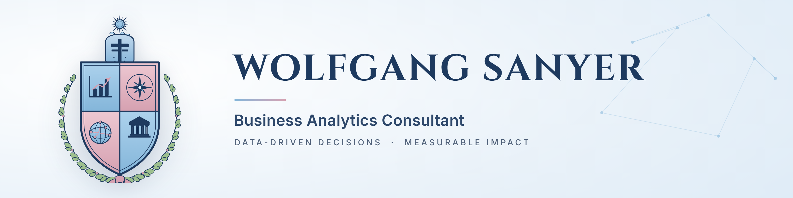

  

<h3 align="center">Business Intelligence&nbsp; &middot; &nbsp;Applied AI&nbsp; &middot; &nbsp;Infrastructure Analytics</h3>

  
  &nbsp;
  

---

### About

I help organizations turn data into decisions that hold up. My work sits at the intersection of business intelligence, applied AI, and infrastructure analytics, built on a career in enterprise technology and analytics consulting.

Right now I am completing an MBA in Business Analytics at Fayetteville State University (2026) and standing up an infrastructure-analytics consulting practice launching in summer 2026. I am also a published IBM Redbook author.

- Business Analytics Consultant
- Based in Fayetteville, North Carolina
- Ask me about analytics, business intelligence, SAS, and applied AI

### Toolbox

**Analytics &amp; Data**

**AI &amp; Apps**

### Current Focus

- Standing up an infrastructure-analytics consulting practice (EV infrastructure, energy, workforce)
- Applied AI: retrieval-augmented assistants, agentic workflows, and MCP
- Decision analytics with SQL, SAS, and Python
- MBA capstone work in advanced analytics

### Featured Work

| Project | What it is |
| --- | --- |
| [**lodestar**](https://github.com/wolfieman/lodestar) | Agentic, RAG-grounded HBCU career-advice assistant (hybrid RAG + MCP, model-agnostic). Evolved from IgniteAI, 1st place at the HP Future of Work Accelerator. [Live demo](https://lodestar.sanyer.org) |
| [**ev-pulse-nc**](https://github.com/wolfieman/ev-pulse-nc) | North Carolina EV infrastructure gap analysis: data pipelines, forecasting, and policy-ready insight. |
| [**vendor-scope**](https://github.com/wolfieman/vendor-scope) | Vendor readiness and availability analytics. Public procurement data turned into an audited, decision-ready view. |

### GitHub

  

### Connect

[Website](https://www.sanyer.org) &nbsp;&middot;&nbsp; [LinkedIn](https://www.linkedin.com/in/wolfgangsanyer)

<!---
wolfieman/wolfieman is a special repository: this README.md renders on the GitHub profile page.
--->
